# Crest Comprehensive Development Plan

## 1. Project Understanding

Crest is a professional cryptocurrency analytics terminal for analysts who need dense, real-time market data, chain-level comparison, configurable filters, and an AI assistant that only reasons over the currently visible data context.

The product is not a landing page, retail crypto app, or general AI chatbot. It is a terminal-style market workstation with three primary surfaces:

- Real-time asset grid for the top 300 cryptocurrencies by market cap.
- Chain performance heatmap for comparing native-chain strength and volume behavior.
- Bottom-drawer AI assistant that answers questions using only the current filtered data snapshot.

The canonical product name is **Crest**.

## 2. Core Product Requirements

### 2.1 Market Data

- Track the top 300 cryptocurrencies by market cap.
- Refresh real-time asset data every 60 seconds through Supabase Realtime delivery to the frontend.
- Use CoinGecko Pro API or a CCXT-based aggregator as the upstream market source.
- Compute indicators server-side:
  - RSI(14)
  - MA111
  - 24h volume delta
  - 24h price delta
  - Distance from MA111: `((price - ma111) / ma111) * 100`
- Support two timeframes:
  - `30m`
  - `4h`
- Timeframe changes must affect all computed columns and update without a page reload.
- Store computed indicators as fresh Supabase snapshots, overwritten every 60 seconds per asset per timeframe.

### 2.2 Asset Grid

Each visible asset row must include:

- Price in USD.
- 24h price change percentage.
- RSI(14) with micro gauge.
- 24h volume change percentage.
- Native chain label.
- MA111 value.
- Distance from MA111 percentage.

The grid must support:

- Virtualized rendering for 300 rows.
- Sticky column header.
- Primary and secondary sorting.
- Header-click sort cycling: none -> ascending -> descending.
- Row highlighting when the AI response references a ticker.
- Pinned assets, up to 5 per user.

### 2.3 Chain Performance

- Group all tracked assets by native chain.
- Compute chain-level metrics:
  - Average price change percentage.
  - Average volume change percentage.
  - Count of gainers.
  - Count of losers.
  - Total asset count.
- Refresh chain metrics every 5 minutes.
- Display an interactive SVG heatmap:
  - X-axis: average price change.
  - Y-axis: average volume change.
  - Bubble size: asset count.
  - Bubble color: green/red signal based on average price change.
  - Bubble opacity: volume-change intensity.
- Clicking a chain bubble filters the asset grid to that chain.

### 2.4 Filters And Presets

- Multi-select chain filter with all/none shortcuts.
- RSI range slider from 0 to 100.
- RSI presets:
  - Oversold
  - Neutral
  - Overbought
- MA111 distance range filter for assets below or above MA111.
- Timeframe toggle in header: `30m | 4h`.
- Save and load filter presets per authenticated user.
- Store presets in Supabase Postgres.
- UI slider visuals must react immediately; API updates should be debounced at 300ms.

### 2.5 Authentication

Crest requires unified sessions with `role: "user" | "admin"`.

Supported sign-in methods:

- OAuth via X/Twitter using Supabase Auth.
  - Store X user ID.
  - Store display name.
- Sign-In with Ethereum using SIWE/EIP-4361 through a server-side verification route.
  - Use wagmi and viem.
  - Use challenge-response.
  - Support MetaMask, WalletConnect, and Phantom where practical.
  - Do not store passwords.

### 2.6 AI Assistant

The AI assistant is a context-constrained market analyst, not a general assistant.

Every AI request must include:

- Current timeframe.
- Current filter state.
- Current visible asset rows, up to 50 rows max.
- Chain summary.
- Pinned assets.
- User message.
- Recent session history, last 20 messages.

AI behavior rules:

- Only analyze data from the injected context.
- If data is absent, respond exactly: `That data is not in the current filtered view.`
- Use ticker format such as `$BTC`, `$ETH`, `$BNB`.
- Keep responses concise and analyst-grade.
- Format percentages to 2 decimal places.
- Stream responses through SSE.
- Highlight matching asset rows when the assistant references tickers.
- End responses with one suggested follow-up question in the documented `Next` format.

Preset prompt mappings:

- Oversold opportunities: list assets with RSI below 35, sorted ascending by RSI, and note MA111 position.
- Chain strength ranking: rank chains by average price change descending, using volume as a tiebreaker.
- Volume anomalies: assets with volume change above 50% and price change below 5%.
- MA111 breakdown watch: assets 0% to -5% below MA111.
- Top gainers by chain: top 24h performer per chain.

### 2.7 Admin Panel

Admin route: `/admin/ai-config`

Requirements:

- Role-gated to `admin`.
- Configure AI providers:
  - Anthropic
  - OpenRouter
  - Ollama
  - OpenAI
  - Groq
  - DeepSeek
  - Custom HTTP endpoint
- Provider config fields:
  - Base URL
  - API key encrypted at rest with AES-256
  - Model name
  - Max tokens
  - Temperature
- Support fallback provider chain.
- Configure per-user AI request daily limit.
- Configure custom platform AI system prompt.

## 3. Recommended Architecture

### 3.1 Repository And Platform Layout

Canonical GitHub repository:

```text
https://github.com/klapauciusalgo/Crest
```

All development should be committed and pushed to this repository. Local git commits should use:

```text
user.email = iman.setyawan@outlook.com
```

Crest will be built as a Vercel-first application with Supabase as the database, auth, realtime, and backend data platform.

```text
crest/
  app/                           # Next.js App Router pages, layouts, route handlers
    admin/
      ai-config/
    api/
      ai/
      cron/
      market/
      siwe/
  components/
    terminal-shell/
    asset-grid/
    chain-heatmap/
    filter-rail/
    ai-drawer/
    auth/
    admin/
  lib/
    indicators/
    ai-provider/
    market/
    supabase/
    auth/
    formatters/
  store/
  supabase/
    migrations/
    seed.sql
  docs/
    requirements/
    architecture/
    runbooks/
  vercel.json
```

This single Next.js repository is the best fit for Vercel Git integration. Backend behavior should be implemented with Next.js route handlers, Vercel Cron Jobs, Supabase Edge Functions where appropriate, Supabase Postgres, and Supabase Realtime without a separate backend service.

### 3.2 Backend Services

Use Vercel and Supabase as the system of record for data ingestion, realtime delivery, auth, AI orchestration, and admin configuration.

Backend modules:

```text
app/
  api/
    market/snapshot/route.ts       # Current market snapshot fallback API
    ai/chat/route.ts               # SSE AI stream
    cron/market-refresh/route.ts   # Vercel Cron entrypoint
    cron/chain-summary/route.ts    # 5-minute chain aggregation
    siwe/challenge/route.ts        # Wallet auth challenge
    siwe/verify/route.ts           # Signature verification
    admin/ai-config/route.ts       # Admin config APIs

lib/
  market/
    providers/
      coingecko.ts
      ccxt.ts
    normalize.ts
    refresh.ts
  indicators/
    rsi.ts
    ma111.ts
  ai-provider/
    base.ts
    fallback.ts
    openai.ts
    anthropic.ts
    openrouter.ts
    ollama.ts
    groq.ts
    deepseek.ts
    custom-http.ts
  supabase/
    client.ts
    server.ts
    admin.ts
    realtime.ts
  auth/
    roles.ts
    siwe.ts
```

### 3.3 Frontend Modules

Use Next.js App Router on Vercel, TypeScript, TanStack Table, Zustand, Tailwind CSS v4, Supabase Auth helpers, wagmi, and viem.

Frontend modules:

```text
app/
  layout.tsx
  page.tsx
  admin/
    ai-config/
      page.tsx
  components/
    terminal-shell/
    asset-grid/
    chain-heatmap/
    filter-rail/
    ai-drawer/
    auth/
    admin/
  lib/
    api-client.ts
    supabase-client.ts
    realtime-client.ts
    ai-context.ts
    ticker-highlighting.ts
    formatters.ts
    design-tokens.ts
  store/
    market-store.ts
    filter-store.ts
    session-store.ts
    ai-store.ts
```

### 3.4 Data Flow

```mermaid
flowchart LR
  Upstream["CoinGecko Pro or CCXT"] --> Cron["Vercel Cron Job"]
  Cron --> Ingest["Next.js Route Handler or Supabase Edge Function"]
  Ingest --> Indicators["Indicator Engine"]
  Indicators --> PG["Supabase Postgres"]
  PG --> RT["Supabase Realtime Broadcast"]
  RT --> Web["Next.js Terminal UI on Vercel"]
  PG --> Web
  Web --> AIContext["Visible Data Snapshot"]
  AIContext --> SSE["Vercel AI SSE Route"]
  SSE --> Providers["AI Provider Fallback Chain"]
  Providers --> Web
```



### 3.5 Frontend State Flow

- Supabase Realtime updates write fresh asset data into Zustand.
- Filter state lives in Zustand and controls visible TanStack rows.
- Visible rows are capped to 50 when building AI context.
- Pinned assets are stored per user in Supabase Postgres and mirrored locally.
- AI stream updates the drawer progressively through SSE.
- Ticker parsing from streamed AI text triggers row highlight events.

## 4. Database Plan

### 4.1 Tables

User identity, sessions, and OAuth should be handled through Supabase Auth. Custom public tables should store Crest-specific behavior and should have Row Level Security enabled.

Recommended PostgreSQL tables:

```sql
profiles
  id uuid references auth.users(id)
  display_name
  x_user_id
  wallet_address
  role
  created_at
  updated_at

assets
  id
  symbol
  name
  chain
  provider
  provider_ref
  market_cap_rank
  created_at
  updated_at

market_snapshots
  id
  asset_id
  timeframe
  price_usd
  price_change_24h
  volume_change_24h
  rsi_14
  ma111
  ma_distance_pct
  updated_at

chain_summaries
  id
  chain
  timeframe
  avg_price_change
  avg_volume_change
  gainers
  losers
  asset_count
  updated_at

filter_presets
  id
  user_id
  name
  timeframe
  chain_filter_json
  rsi_min
  rsi_max
  ma_distance_min
  ma_distance_max
  primary_sort_json
  secondary_sort_json
  created_at
  updated_at

pinned_assets
  id
  user_id
  symbol
  created_at

ai_messages
  id
  user_id
  role
  content
  context_snapshot_json
  provider
  model
  created_at

ai_provider_configs
  id
  provider
  base_url
  encrypted_api_key
  model_name
  max_tokens
  temperature
  is_enabled
  priority
  created_at
  updated_at

ai_rate_limits
  id
  role
  requests_per_day
  created_at
  updated_at

app_settings
  key
  value_json
  updated_at
```

All tables in the exposed `public` schema should use explicit RLS policies. Admin-only operations should use server-side Supabase service-role access from Vercel functions and must never expose service credentials to the browser.

### 4.2 Data Retention

- Store AI message history per user, but only inject the latest 20 messages.
- Avoid storing every 60-second market snapshot unless historical replay is explicitly added.
- Store compact context snapshots for AI auditability, not full upstream payloads.
- Consider a future time-series database only if historical charting becomes a first-class requirement.

## 5. API Contract Plan

### 5.1 REST Endpoints

```text
GET    /api/health
GET    /api/market/assets?timeframe=30m|4h
GET    /api/market/chains?timeframe=30m|4h
POST   /api/ai/chat
GET    /api/ai/messages
POST   /api/siwe/challenge
POST   /api/siwe/verify
POST   /api/cron/market-refresh
POST   /api/cron/chain-summary
GET    /api/admin/ai-config
POST   /api/admin/ai-config/providers
PATCH  /api/admin/ai-config/providers/{id}
DELETE /api/admin/ai-config/providers/{id}
PATCH  /api/admin/ai-config/rate-limits
PATCH  /api/admin/ai-config/system-prompt
```

User-owned rows such as filter presets and pinned assets can be read and written directly through Supabase client APIs under RLS, with server route handlers reserved for privileged actions.

### 5.2 Realtime Channels

```text
Supabase Realtime topic: market:30m
Supabase Realtime topic: market:4h
Supabase Realtime topic: chains:30m
Supabase Realtime topic: chains:4h
```

Message examples:

```json
{
  "type": "asset_snapshot",
  "timeframe": "4h",
  "updated_at": "2026-05-30T00:00:00Z",
  "assets": []
}
```

```json
{
  "type": "chain_summary",
  "timeframe": "4h",
  "updated_at": "2026-05-30T00:00:00Z",
  "chains": []
}
```

### 5.3 AI SSE Endpoint

```text
POST /ai/chat
Accept: text/event-stream
```

The Vercel route handler must validate that the context shape matches the current schema, enforce row limits, apply user rate limits, inject the configured system prompt, and stream provider output back to the client.

## 6. Indicator Computation Plan

### 6.1 Price And Candle Requirements

RSI(14) and MA111 need candle data, not only current ticker data.

For each asset and timeframe:

- Maintain recent candles for `30m` and `4h`.
- Need at minimum:
  - 15 candles for RSI(14), preferably more for stability.
  - 111 candles for MA111.
- Store computed values per symbol and timeframe with `updated_at` freshness checks.

### 6.2 Calculation Rules

- RSI should use a standard Wilder smoothing implementation.
- MA111 should use simple moving average unless product later specifies EMA.
- `ma_distance_pct` should be computed after price and MA111 are normalized to the same quote currency.
- Price and volume deltas should use consistent 24h windows, independent of selected indicator timeframe unless explicitly changed.

### 6.3 Serverless Runtime Considerations

Vercel functions are request/response oriented and should not run permanent WebSocket servers or long-lived workers. Use:

- Vercel Cron Jobs to trigger scheduled refresh endpoints.
- Supabase Postgres to store normalized snapshots.
- Supabase Realtime Broadcast or Postgres Changes to deliver updates over WebSockets.
- Supabase Edge Functions for ingestion work that fits better near the database.

### 6.4 Data Provider Risk

CoinGecko and CCXT may differ in symbol identity, chain mapping, market cap rank, and candle availability.

Mitigation:

- Build a provider abstraction from day one.
- Normalize all market assets into internal `asset_id`, `symbol`, `name`, `chain`, and `provider_ref`.
- Keep a manually curated chain mapping fallback for ambiguous assets.

## 7. UI/UX Implementation Plan

### 7.1 Visual System

Follow the terminal design requirements strictly:

- Background primary: `#0D0E11`.
- Background secondary: `#141519`.
- Border: `#1E2028`.
- Text primary: `#E8E9EC`.
- Text muted: `#5A5C6A`.
- Positive: `#1DB87E`.
- Negative: `#E5484D`.
- RSI oversold: `#4C9EFF`.
- RSI overbought: `#FF8C42`.
- MA below: `#FF5C5C`.
- MA above: `#3DD68C`.

Avoid:

- Gradients.
- Glow.
- Glassmorphism.
- Landing page hero sections.
- Retail crypto imagery.
- WhatsApp-style AI chat bubbles.
- Pulse skeletons.
- Modal-heavy flows.

### 7.2 Main Layout

```text
Header
  Logo
  Timeframe segmented control
  Auth controls

Left rail, 240px
  Chain heatmap summary
  Chain filter
  RSI slider and presets
  MA111 distance filter
  Saved presets

Main workspace
  Virtualized asset grid
  Optional heatmap-expanded view

Bottom drawer
  AI assistant
```

### 7.3 Component Milestones

- `TerminalShell`: global layout and resize behavior.
- `HeaderBar`: product identity, timeframe toggle, session controls.
- `FilterRail`: chain filters, RSI controls, MA111 controls, saved presets.
- `AssetGrid`: TanStack Table, virtualization, sticky headers, sorting.
- `RsiGauge`: block gauge plus right-aligned numeric value.
- `ChainBadge`: constrained pill with chain color identity.
- `MaDistanceCell`: arrow, signed percentage, directional color.
- `ChainHeatmap`: custom SVG bubble chart.
- `AiDrawer`: collapsed and expanded terminal chat states.
- `AdminAiConfigForm`: provider management and fallback priority.

## 8. AI Provider Architecture

### 8.1 Provider Interface

All AI providers should implement one internal interface:

```ts
interface AiProvider {
  id: string;
  streamChat(input: AiChatInput): AsyncIterable<AiTokenEvent>;
  healthCheck(): Promise<AiProviderHealth>;
}
```

The implementation should stay in TypeScript so provider logic can run inside Vercel route handlers or Supabase-compatible server code.

### 8.2 Fallback Strategy

- Sort enabled providers by admin-defined priority.
- Try primary provider first.
- On timeout, network error, or provider-specific retryable error, move to next provider.
- Do not retry unsafe duplicate requests against a provider that already started streaming meaningful output.
- Log selected provider, error class, latency, token usage when available, and fallback result.

### 8.3 Prompt Assembly

Prompt assembly should be deterministic:

1. Platform system prompt from admin config.
2. Fixed Crest behavioral rules.
3. Current injected data context.
4. Last 20 user/session messages.
5. Current user message.

The backend should own this assembly so clients cannot bypass context constraints.

## 9. Security Plan

### 9.1 Authentication And Authorization

- Treat frontend session data as advisory only.
- Enforce role checks in Vercel route handlers and Supabase RLS policies for admin APIs and admin tables.
- Validate SIWE nonce, domain, issued-at time, expiration, and wallet signature.
- Prevent account duplication when the same user links X and wallet auth later.
- Store role and authorization claims in trusted profile/app metadata, not user-editable metadata.

### 9.2 Secrets

- Encrypt AI provider API keys at rest using AES-256.
- Keep encryption key outside the database.
- Use environment variables or secret manager for:
  - Supabase project URL
  - Supabase publishable key
  - Supabase service-role key, server only
  - Provider encryption key
  - OAuth secrets
  - Upstream market-data API keys

### 9.3 AI Abuse Controls

- Enforce daily user AI request limits server-side.
- Store request count in Supabase Postgres, with daily reset logic or date-scoped counters.
- Cap context rows at 50.
- Cap message history at 20 messages.
- Validate and sanitize admin custom provider URLs.
- Block private network targets for custom HTTP providers unless explicitly allowed in deployment config.

## 10. Performance Plan

### 10.1 Backend

- Use Vercel Cron and Supabase snapshot freshness checks so stale indicators are overwritten every 60 seconds.
- Batch upstream market requests.
- Avoid per-client recomputation; broadcast shared computed snapshots through Supabase Realtime.
- Recompute chain summaries every 5 minutes.
- Use scheduled Vercel Cron route handlers or Supabase Edge Functions for ingest and indicator computation.

### 10.2 Frontend

- Use row virtualization despite only 300 rows because cells are information-dense and update frequently.
- Memoize column definitions.
- Keep market data updates normalized by asset symbol/id.
- Use tabular numerals globally for financial values.
- Keep transitions under 200ms.
- Avoid layout shifts by defining stable column widths.

### 10.3 Latency Targets

- Realtime snapshot delivery: under 500ms after backend refresh.
- Filter visual response: under 16ms.
- Debounced filter persistence/API request: 300ms.
- Timeframe switch perceived response: instant local state change, update values when snapshot arrives.
- AI first token: target under 2 seconds after provider selection.

## 11. Testing Strategy

### 11.1 Backend Tests

- Indicator tests:
  - RSI known-series fixtures.
  - MA111 known-series fixtures.
  - MA distance precision and sign.
- Market provider normalization tests.
- Supabase snapshot freshness behavior.
- Chain summary aggregation tests.
- AI context builder tests:
  - Max 50 visible rows.
  - Pinned assets injection.
  - Filter state accuracy.
  - Missing-data response path.
- AI fallback chain tests.
- Rate-limit tests.
- Admin role authorization tests.
- SIWE signature validation tests.

### 11.2 Frontend Tests

- Asset grid renders all required columns.
- Sort cycle works: none -> asc -> desc.
- RSI range slider updates state immediately.
- Filter presets save/load correctly.
- Timeframe toggle updates data subscriptions.
- Chain bubble click filters table.
- AI drawer streams text and highlights referenced tickers.
- Admin AI config is hidden from non-admin users.

### 11.3 End-To-End Tests

- Sign in through mocked X OAuth.
- Sign in through mocked SIWE wallet.
- Load terminal with mocked market stream.
- Apply filters and ask AI preset prompt.
- Verify AI receives only visible filtered rows.
- Verify provider fallback when primary fails.
- Verify admin can configure provider and rate limit.

## 12. Delivery Phases

### Phase 0: Project Foundation

Deliverables:

- GitHub repository initialized at `klapauciusalgo/Crest`.
- Vercel project connected to the GitHub repository.
- Supabase project linked to the app.
- Environment variable templates.
- Basic Next.js app with health endpoint and terminal shell.
- Shared schema definitions.
- CI checks for linting, formatting, type checks, and tests.

Exit criteria:

- Local developer can run the Next.js app and connect to Supabase with documented commands.
- Health checks pass.

### Phase 1: Market Data And Indicators

Deliverables:

- Market provider abstraction.
- CoinGecko Pro or CCXT provider implementation.
- Top 300 asset ingestion.
- Candle ingestion for `30m` and `4h`.
- RSI(14), MA111, deltas, and MA distance computation.
- Supabase snapshot freshness/update logic.
- Supabase Realtime market snapshot stream.

Exit criteria:

- Frontend can receive live or mocked market snapshots for both timeframes.
- Indicator tests pass against known fixtures.

### Phase 2: Terminal UI Core

Deliverables:

- Header with timeframe segmented control.
- Left filter rail.
- Virtualized asset grid.
- RSI micro gauge.
- Chain labels.
- MA111 distance cell.
- Primary and secondary sorting.
- Responsive terminal layout.

Exit criteria:

- 300-row data set renders smoothly.
- Sort and filters work with mocked and live data.
- UI matches the documented terminal visual language.

### Phase 3: Chain Heatmap

Deliverables:

- Chain summary backend aggregation.
- Five-minute chain summary refresh.
- Custom SVG bubble heatmap.
- Tooltip.
- Bubble click-to-filter behavior.
- Heatmap/grid view toggle if needed.

Exit criteria:

- Chain metrics match backend aggregation tests.
- Clicking a chain bubble updates the filtered grid.

### Phase 4: Authentication And User State

Deliverables:

- Supabase X OAuth.
- SIWE challenge-response flow.
- Unified user model.
- Role support.
- Pinned assets.
- Saved filter presets.

Exit criteria:

- Authenticated users can save/load presets and pin up to 5 assets.
- Admin role is distinguishable and enforced.

### Phase 5: AI Assistant

Deliverables:

- Context builder from visible grid state.
- AI SSE streaming endpoint.
- Session history persistence.
- Preset prompt dropdown.
- Ticker parsing and grid-row highlight.
- Provider abstraction for at least one initial provider.
- Exact fallback response for absent data.

Exit criteria:

- AI answers only from injected context.
- Preset prompts produce expected analysis.
- Streamed response highlights referenced tickers.

### Phase 6: Admin AI Configuration

Deliverables:

- `/admin/ai-config` route.
- Provider CRUD.
- AES-256 API key encryption at rest.
- Provider fallback priority.
- AI rate-limit controls.
- Custom system prompt editor.

Exit criteria:

- Admin can configure providers.
- Non-admin users cannot access admin route or APIs.
- Fallback provider chain works under simulated provider failure.

### Phase 7: Hardening And Production Readiness

Deliverables:

- Observability logs and metrics.
- Deployment configuration.
- Rate-limit monitoring.
- Upstream data failure handling.
- Supabase Realtime reconnect strategy.
- Browser compatibility verification.
- Security review.
- Performance pass.

Exit criteria:

- App survives provider outages gracefully.
- App remains responsive under realistic update rates.
- Production deployment checklist is complete.

## 13. Suggested Implementation Order

1. Lock product name, provider choice, and deployment target.
2. Scaffold Next.js, Vercel, and Supabase foundation.
3. Define shared market, chain, filter, and AI context schemas.
4. Build mocked data stream before integrating paid upstream APIs.
5. Implement terminal UI against mocked data.
6. Add real market ingestion and indicator computation.
7. Add auth and persisted user state.
8. Add AI context builder and streaming responses.
9. Add admin provider configuration.
10. Harden, test, deploy, and monitor.

This order lets the terminal experience be validated early while backend data integrations mature behind stable contracts.

## 14. Open Decisions

- Confirm whether CoinGecko Pro or CCXT is the first production provider.
- Confirm whether historical candle storage is required or whether recent candles can be cache-first.
- Confirm the Vercel project/team and Supabase project for preview and production environments.
- Confirm whether Next.js 14 is mandatory or whether the team wants to use the current stable Next.js version while preserving App Router behavior.
- Confirm how X OAuth and wallet identities should merge when a user uses both.
- Confirm whether Phantom support means Solana wallet authentication in addition to EVM SIWE, because SIWE itself is Ethereum-specific.
- Confirm whether admin users are manually seeded or promoted through an internal admin action.
- Confirm whether market data should be globally identical for all users or personalized by saved default filters.

## 15. Key Risks And Mitigations

| Risk | Impact | Mitigation |
| --- | --- | --- |
| Upstream provider rate limits | Missing or delayed market updates | Batch requests, cache aggressively, add provider abstraction |
| Ambiguous chain mapping | Incorrect heatmap grouping | Maintain curated chain mapping with provider overrides |
| Candle availability gaps | Incorrect RSI/MA111 values | Mark unavailable indicators with static dashes and log gaps |
| Frequent realtime updates | UI jank | Normalize store updates, virtualize rows, stabilize column widths |
| AI hallucination beyond context | User mistrust | Backend-owned prompt assembly and strict missing-data fallback |
| Custom provider config misuse | Security exposure | URL validation, encrypted keys, admin-only access, SSRF controls |
| Multi-auth account duplication | Fragmented user state | Add account-linking logic around normalized user identity |

## 16. MVP Scope Recommendation

The practical MVP should include:

- Mock and real market data source behind the same provider interface.
- Top 300 asset grid.
- `30m` and `4h` timeframe support.
- RSI(14), MA111, price delta, volume delta, MA distance.
- Chain filter, RSI filter, MA distance filter.
- Chain heatmap.
- One auth method plus user presets, then add the second auth method.
- AI assistant with one provider, SSE streaming, context injection, and preset prompts.
- Admin provider configuration after the first AI provider path is stable.

The polished v1 should add:

- Full dual-auth account linking.
- Complete provider fallback chain.
- Daily rate limits.
- Production observability.
- Security review for custom HTTP providers and encrypted secrets.
